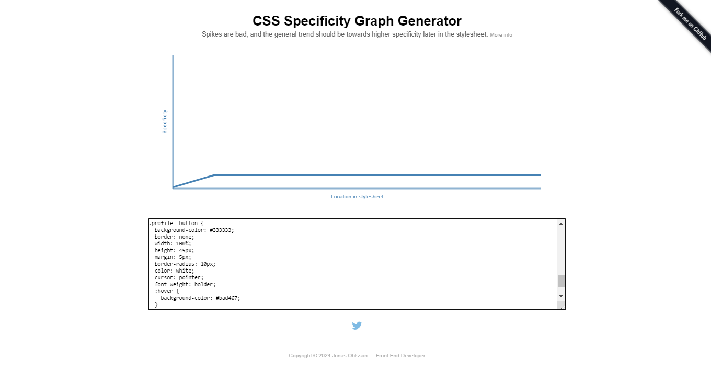

# BEM (Block, Element, Modifier)

**Bloque**: Contenedor o etiqueta que dentro de si tiene otros elementos.

**Elemento**: Etiqueta HTML que forma parte de un bloque.

**Modificador**: Característica que permite diferencia elementos dentro de un bloque. Se puede apreciar que un bloque puede ser un elemento de un bloque superior y viceversa.

Explorando en varios lugares, la metodologia BEM nos sirve para dar claridad y legibilidad al codigo, nos basamos en bloques que contienen elementos y un bloque puede ser un elemento de otro bloque y podriamos modificarlos en como nos convenga. Por ejemplo si tenemos un <div> en este caso :

Así nombrariamos a un bloque

```HTML
<div class="container"> </div>
```

```CSS
.container{
    display: flex;
}
```
Aquí tendriamos un elemento:

```HTML
<div class="container">
    
</div>
```

```CSS
.container__img{
    width: 300px;
    height: 300px;
}
```

Y los modificadores

```HTML
<div class="container">
    
    <p class="container__img--uppercase">Este es un elemento modificado</p>
</div>
```

```CSS
.container__img--uppercase{
    text-transform: uppercase;
}
```

Tenemos un ejemplo en la carpeta reactbem de un proyecto en react con BEM su especificidad es la siguiente 



Un problema que surge al usar una clase con hover es el siguiente que sucedio aquí 


Vemos un incremento en el grafico y no deberia ocurrir tal cosa

# ¿Quieres visitar el proyecto? 

https://metodologias-css.vercel.app/